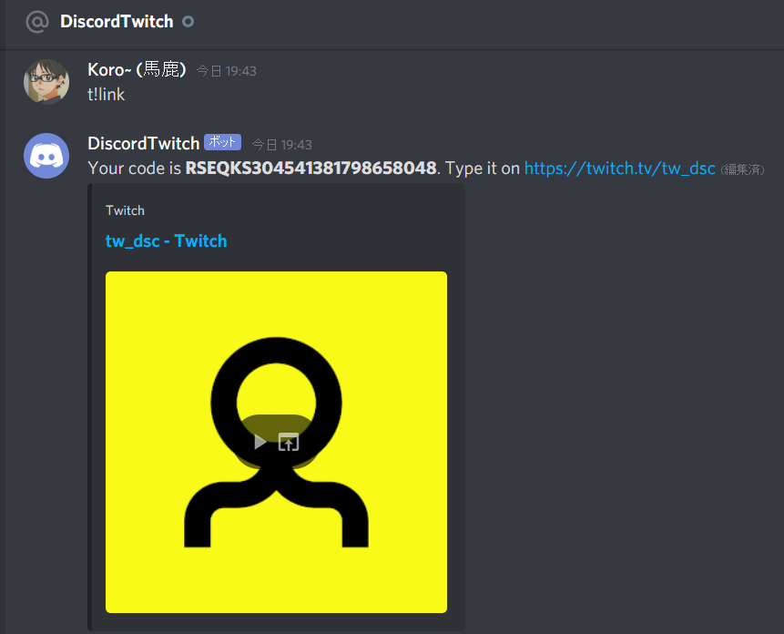

# tw-dsc
## Discord linking tool for Twitch

---------------
### A best way to know your followers
With tw-dsc, you can link a Discord account to a Twitch account.

#### Requirements
- [NodeJS](https://nodejs.org)
- [NPM](https://npm.im)
- [node-gyp](https://npm.im/node-gyp)

#### Install

- Clone the repository by using `git clone https://github.com/korobaka/tw-dsc.git`
- Install the dependencies by using `npm i`
- Configure your .env (using example.env) and data/channels.js
- Run the code by using `node index`

#### Usage

1. Send t!link to your bot in DMS

2. A code will be given. Simply type it in the channel chat.

3. When your account has been linked, you receive a discord DM from the bot.

4. Type t!whoami command to check your linked account!

